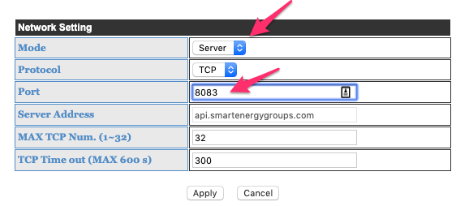
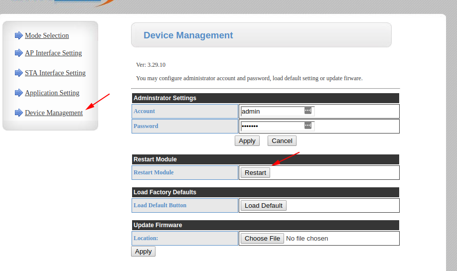

weewx-brultech
======

Extension to the WeeWX weather system for collecting data and generating reports for the
Brultech GEM energy monitors.

## Overview

This is a extension for the WeeWX weather system for the Brultech GEM energy monitor. While an
energy monitor is very different from a weather station, WeeWX is a very flexible system and has no
trouble running the driver. The extension includes three parts:

- A driver for the GEM energy monitor. The driver is designed to poll your energy monitor at 
regular intervals, typically every 10-15 seconds, then pass the data on to the rest of the WeeWX
system.

- A database schema designed for the monitor. Because the types used by an energy monitor are so
  radically different from a weather station, this extension includes a specialty schema (called
  `gem_schema`), specifically designed for the Brultech monitors. It will be used to initialize a
  separate database from the conventional WeeWX weather database, allowing both to be run
  simultaneously. By default, it will include space for 32 channels.

- A WeeWX skin, called _SeasonsPower_, designed to display current, week, month, and year energy use. It
also includes monthly energy summaries. It can easily be customized by following the directions
in the _[WeeWX Customization Guide](http://www.weewx.com/docs/customizing.htm)_.

What follows are directions for installing the extension. It consists of five parts:
1. [Configuring your Brultech monitor](#Configuring-your-Brultech-device)
2. [Installing WeeWX](#Install-WeeWX)
3. Installing the extension, either by using the WeeWX 
[installer](#Install-the-extension-by-using-the-WeeWX-installer),
or [manually](#Installing-the-extension-manually).
4. [Select database options](#Select-database-options)
5. [Start up WeeWX](#Starting-WeeWX)

## Configuring your Brultech device
The Brultech energy monitors come with a bewildering array of modes and options. To keep things
simple, this driver makes two assumptions:

- The device will always be in server mode.
- The device driver will always poll the device.

This makes it pretty easy to configure the device:

1. Set the GEM to "server mode".
Using a browser, connect to your GEM (http://192.168.1.104, in my case) 
and go to the "Application Settings" page. 
Set it to server mode, using port 8000:

    

    Click Apply.
    
2. Then click on the "Device Management" tab, and click the "Restart" button under 
*Restart Module*.

    
    
The monitor will reboot and be ready to receive commands from the driver.
That's it for the monitor. 

Next step is to install WeeWX.

## Install WeeWX

It is strongly recommended that you use the "setup.py" method for installing WeeWX. All of the
instructions that follow assume this.

Follow the instructions in the [setup.py install guide](http://www.weewx.com/docs/setup.htm) and
install WeeWX. When asked, specify that the `Simulator` driver be used. When you're done, WeeWX
will be installed in `/home/weewx`. 

### Deactivate weather skins
By default, when WeeWX is installed, it installs the _Seasons_ skin and activates it. You will
need to deactivate it. In the WeeWX configuration file `weewx.conf`, generally located in
`/home/weewx/weewx.conf`, set option `enable` to `false` for the _Seasons_ report. When you're
done, it will look like this:

```ini
    ...
    [[SeasonsReport]]
        # The SeasonsReport uses the 'Seasons' skin, which contains the
        # images, templates and plots for the report.
        skin = Seasons
        enable = false
        lang = en
        unit_system = us
```

Next step is to install the weewx-brultech extension itself, either by using the WeeWX installer,
or manually.

## Install the extension by using the WeeWX installer

This section describes how to install `weewx-brultech` using the WeeWX installer.

### Download and install
Download the `weewx-brultech` package and install it using the WeeWX installer:

```shell
cd /home/weewx
wget https://github.com/tkeffer/weewx-brultech/archive/master.zip
./bin/wee_extension --install=master.zip
```

### Configure
When you're done with the installation, your WeeWX configuration will be set up to use the Brultech
driver. However, you still have to configure the driver. Do this by using the `wee_config`
utility with the `--reconfigure` option:
```shell
./bin/wee_config --reconfigure
```

It will give you the opportunity to change various settings. Eventually, it will ask about options
for the Brultech driver:

```
Specify the IP address (e.g., 192.168.0.10) or hostname of the Brultech monitor.
host [192.168.1.104]: 192.168.0.7
Specify the port
port [8000]: 
Saved backup to /home/weewx/weewx.conf.20211025164234
```

In this example, we have changed the host from `192.168.1.104` to `192.168.0.7`, but accepted
the default port (`8000`).

## Installing the extension manually

This section describes how to manually configure WeeWX to use this extension.

### Download and unpack

Download the `weewx-brultech` package and unpack it

```shell
cd /home/weewx
wget https://github.com/tkeffer/weewx-brultech/archive/master.zip
tar xvf master.zip
```

### Copy files
Put the files `brultech.py` and `gem_schema.py` in the `user` subdirectory. Typically,

```shell
cd /home/weewx/weewx-brultech-master
cp bin/user/brultech.py /home/weewx/bin/user
cp bin/user/gem_schema.py /home/weewx/bin/user
```

Copy the `StandardPower` skin over:
```shell script
cp -r skins/StandardPower /home/weewx/skins
```

### Configure `weewx.conf`

This section is about manually configuring the configuration file, `weewx.conf`, usually found
in `/home/weewx/weewx.conf`.

1. __Add section `[Brultech]`__

    Insert a new stanza `[Brultech]` into your `weewx.conf` file that looks like this:

    ```ini
    [Brultech]

        # See README.md for instructions on how to configure the Brultech devices!!
    
        # Power is computed as the difference between energy records. How old a 
        # record can be and still be used for this calculation:
        stale = 1800
    
        # How often to poll the device for data
        poll_interval = 5

        # Max number of channels to emit. Limit is set by hardware (48 for GEM).
        max_channels = 32
    
        # The type of packet to use. Possible choices are GEMBin48NetTime, GEMBin48Net,
        # or GEMAscii:
        packet_type = GEMBin48NetTime
    
        # Max number of times to try an I/O operation before declaring an error
        max_tries = 3
    
        driver = user.brultech

        # The type of connection to use. It should match a section below. 
        # Right now, only 'socket' is supported.
        connection = socket
    
        # The following is for socket connections: 
        [[socket]]
            host = 192.168.1.104
            port = 8000
            timeout = 20
            # After sending a command, how long to wait before looking for a response    
            send_delay = 0.2

        [[sensor_map]]
    ```

    Be sure to set options `host` and `port` to their proper values for your network configuration.

2. __Set station type__

    Tell WeeWX to use the Brultech device driver by setting `station_type`, 
under section `[Station]`, to `Brultech`:
 
     ```ini
    [Station]

        ...

        # Set to type of station hardware. There must be a corresponding stanza
        # in this file with a 'driver' parameter indicating the driver to be used.
        station_type = Brultech
    ```

3. __Configure new binding__

    Under stanza `[DataBindings]`, add a new database binding `bt_binding` for the Brultech device.
    It should look like this: 

    ```ini
   [DataBindings]

     ...

        [[bt_binding]]
            # The database must match one of the sections in [Databases].
            database = bt_sqlite
            # The name of the table within the database
            table_name = archive
            # The manager handles aggregation of data for historical summaries
            manager = weewx.manager.DaySummaryManager
            # The schema defines the structure of the database.
            # It is *only* used when the database is created.
            schema = user.gem_schema.schema
    ```

4. __Configure new database__

    Under stanza `[Databases]`, add a new database `bt_sqlite`:
    ```ini
    [Databases]
   
    ...
   
        [[bt_sqlite]]
            database_name = weepwr.sdb
            database_type = SQLite  
    ```
   
5. __Use the new binding__ 

    Under stanza `[StdArchive]`, set the option `data_binding` to `bt_binding`. This will cause
    new data to be archived in the database dedicated to Brultech data.
    
    ```ini
    [StdArchive]

        ...
   
        data_binding = bt_binding         
   ```
   
6. __Configure and activate the _SeasonsPower_ skin__
 
   Add a subsection to `[StdReport]` for the _SeasonsPower_ skin, and activate it by
   setting `enable` to `True`:
    
   ```ini
   [StdReport]
    
       ...
    
       [[PowerReport]]
           skin = SeasonsPower
           enable = True
           data_binding = bt_binding
           [[[Units]]]
               [[[[Groups]]]]
                   group_energy2 = kilowatt_hour
   ```
   Incidentally, while you're in there, make sure that any "weather" skins have been deactivated 
   --- they won't work with the data from the energy monitor!
    
8. __Make sure the configuration service runs__
 
    Because of its many specialized types, the Brultech driver requires setting up some custom
 configurations. This is done by the service `brultech.BrultechService`. You must
 add it to the list of services to run by adding it to `data_services`. So, now
 your `[Engine]` section looks something like this: 
 
    ```ini
    [Engine]
    
       [[Services]]
           # This section specifies the services that should be run. They are
           # grouped by type, and the order of services within each group
           # determines the order in which the services will be run.
           prep_services = weewx.engine.StdTimeSynch,
           data_services = user.brultech.BrultechService
           process_services = weewx.engine.StdConvert, weewx.engine.StdCalibrate, weewx.engine.StdQC, weewx.wxservices.StdWXCalculate
           ...
    ```

## Select database options
The default schema works well for most applications. However, you may want to tune it for special
cases. Take a look in the schema's file, usually located in `/home/weewx/bin/user/gem_schema.py`, and you will see
a number of options. Here are their meanings


| Option                          | Default | Meaning                                                                   |
|---------------------------------|---------|---------------------------------------------------------------------------|
| `MAX_CURRENT_CHANNELS`          | `32`    | How many current channels to include in the schema. Max for GEM is 32.    |
| `MAX_TEMPERATURE_CHANNELS`      | `8`     | How many temperature channels to include in the schema. Max for GEM is 8. |
| `MAX_PULSE_CHANNELS`            | `4`     | How many pulse (counter) channels to include. Max for GEM is 4.           |
| `INCLUDE_ACCUMULATED_ABSOLUTE`  | `True`  | Store accumulated (since device reset) absolute energy.                   |
| `INCLUDE_ACCUMULATED_POLARIZED` | `False` | Store accumulated (since device reset) polarized energy.                  |
| `INCLUDE_DELTA_ABSOLUTE`        | `True`  | Store delta absolute energy.                                              |
| `INCLUDE_DELTA_POLARIZED`       | `False` | Store delta polarized energy.                                             |
| `INCLUDE_POWER_ABSOLUTE`        | `False` | Store the average absolute power consumed during archive period.          |
| `INCLUDE_POWER_POLARIZED`       | `False` | Store the average polarized power consumed during archive period.         |


## Starting WeeWX
You're done installing and configuring the extension. You can start WeeWX either directly from the
command line, or start it as a daemon. Instructions are in the WeeWX User's Guide, in the section
[_Running WeeWX_](http://www.weewx.com/docs/usersguide.htm#running).

## Observation types

The driver can emit the following types:

| Type               | Python type | Meaning                                                    |
|--------------------|-------------|------------------------------------------------------------|
| `dateTime`         | `int`       | Timestamp in unix epoch time                               |
| `serial`           | `str`       | The unit serial number                                     |
| `unit_id`          | `int`       | Unit identification number                                 |
| `secs`             | `int`       | Continuous device uptime                                   |
| `chNN_count`       | `int`       | Pulse count in channel `NN`                                |
| `chNN_volt`        | `float`     | Voltage in channel `NN`                                    |
| `chNN_temperature` | `float`     | Temperature in channel `NN`                                |
| `chNN_amp`         | `float`     | Current (amperage) in channel `NN`                         |
| `chNN_a_power`     | `float`     | Average absolute power over an archive period (see below)  |
| `chNN_p_power`     | `float`     | Average polarized power over an archive period (see below) |
| `chNN_a_energy2`   | `float`     | Total accumulated absolute energy (see below)              |
| `chNN_p_energy2`   | `float`     | Total accumulated polarized energy (see below)             |
| `chNN_ad_energy2`  | `float`     | Absolute energy over an archive period (see below)         |
| `chNN_pd_energy2`  | `float`     | Polarized energy over an archive period (see below)        |

where `NN` is the channel number. NB: the channel number uses no leading zero. For example, it is `ch2_volt`, 
NOT `ch02_volt`.

So, for example:
- `ch14_p_energy2` would be the accumulated polarized energy in channel 14.
- `ch2_a_energy2` would be the accumulated absolute energy in channel 2.
- `ch2_ad_energy2` would be the absolute energy used during the archive interval in channel 2.

## Accumulated vs delta energy.

### Accumulated

The Brultech energy monitors emit *accumulated* energy in units of watt-seconds. Accumulated energy is the amount of
energy that has flowed through the channel since the monitor was reset. Because a watt-second is a small amount of
energy, and it may be years since your monitor was reset, this can often be a very large number. Fortunately, the
Brultech monitors reserve five bytes for this value, so it can count up to over 300,000 kWh. A typical home might use
10,000 kWh per year, so the value is unlikely to rollover for years.

### Delta

WeeWX uses accumulated energy to calculate *delta* energy, which is the amount of energy that flowed through the channel
in an archive interval (typically 5 minutes). It is the *difference* in accumulated energy between the beginning and the
end of the interval.

### Calculations
To calculate the amount of power used over, say, a month, you can either take the difference in accumulated
energy, or you can sum the smaller delta energies for the month. Here's an example using channel 8:

| Strategy                           | Tag                          |
|------------------------------------|------------------------------|
| Calculate using accumulated energy | `$month.ch8_a_energy2.diff`  |
| Calculate using delta energy       | `$month.ch8_ad_energy2.sum`  |


### Which to use?
By default, both values are stored in the database. The skins that come with `weewx-brultech` use accumulated energy.

They each have their advantages.

#### Advantage accumulated energy

The calculation is very efficient: only two numbers need be looked up in the database. By contrast, using delta energies
requires summing all the records.

If the computer running WeeWX goes down during the time period, but the energy monitor stays up, it won't affect the
final result. This is because you only need the first and last value for the time period to calculate the total energy
used.

Of course, if the monitor goes down, you will miss energy used during that time period no matter which method you use.

#### Advantage delta energy

If you have technical problems with your monitor and must do a system reset, the counters will go to zero. This means
that if you try to calculate total energy used over a period that includes the reset, and you do the calculation by
calculating differences in accumulated energy, you will get a large negative number. By contrast, if you sum the
delta energies, you will get the correct answer.

The same thing can happen if the battery in your GEM fails. It is responsible for maintaining the count should the power
fail.
